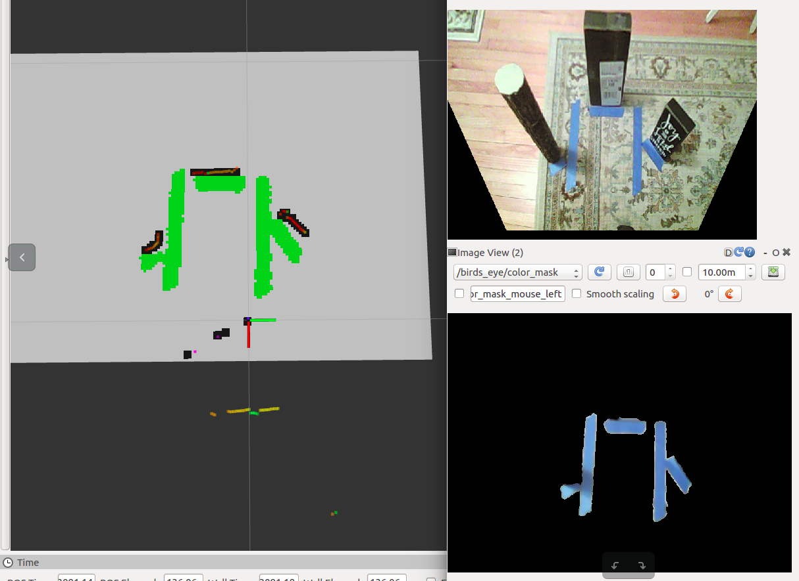

# `birds_eye`

Project lidar data and camera data onto an occupancy grid for simple local navigation



## Running

Change the camera path in `launch/camera.launch`

```
roslaunch birds_eye birds_eye.launch
```

## Configuration

[](https://youtu.be/uj6eqsdXZck)

